# Penetrance Function Map

Generated from the current source on 2026-06-16. This is a starting map for
understanding the package before bug fixing.

## Package Shape

Core source files:

- `R/penetranceMain.R`: public orchestration via `penetrance()`
- `R/mhChain.R`: one Metropolis-Hastings chain
- `R/mhLoglikehood.r`: likelihood and penetrance calculations
- `R/imputeAges.R`: age-imputation helpers
- `R/priorElicitation.R`: default priors and prior construction
- `R/helpers.R`: data transformation and validation helpers
- `R/outputHelpers.R`: chain combination, summaries, and plotting
- `R/data.R`, `R/docData.R`: exported data documentation and default datasets

The package has 34 top-level functions. The main call path is:

```mermaid
graph TD
  penetrance --> validate_allele_freq
  penetrance --> validate_baseline_data
  penetrance --> transformDF
  penetrance --> makePriors
  penetrance --> mhChain
  penetrance --> apply_burn_in
  penetrance --> apply_thinning
  penetrance --> combine_chains
  penetrance --> combine_chains_noSex
  penetrance --> generate_summary
  penetrance --> generate_summary_noSex
  penetrance --> generate_density_plots
  penetrance --> printRejectionRates
  penetrance --> plot_trace
  penetrance --> plot_penetrance
  penetrance --> plot_pdf
  penetrance --> plot_loglikelihood
  penetrance --> plot_acf

  mhChain --> calculateEmpiricalDensity
  mhChain --> imputeAgesInit
  mhChain --> calculate_weibull_parameters
  mhChain --> imputeAges
  mhChain --> mhLogLikelihood_clipp
  mhChain --> mhLogLikelihood_clipp_noSex

  imputeAges --> calculateEmpiricalDensity
  imputeAges --> drawBaseline
  imputeAges --> drawEmpirical
  imputeAges --> clipp_genotype_probabilities["clipp::genotype_probabilities"]

  mhLogLikelihood_clipp --> calculate_weibull_parameters
  mhLogLikelihood_clipp --> lik_fn["lik.fn"]
  mhLogLikelihood_clipp --> clipp_pedigree_loglikelihood["clipp::pedigree_loglikelihood"]

  mhLogLikelihood_clipp_noSex --> calculate_weibull_parameters
  mhLogLikelihood_clipp_noSex --> lik_noSex
  mhLogLikelihood_clipp_noSex --> clipp_pedigree_loglikelihood

  lik_fn --> calculateNCPen
  lik_noSex --> calculateNCPen

  plot_penetrance --> calculate_weibull_parameters
  plot_pdf --> calculate_weibull_parameters
  imputeUnaffectedAges --> drawEmpirical
```

## Function Catalog

| Function | Source | Purpose | Internal dependencies |
|---|---|---|---|
| `penetrance()` | `R/penetranceMain.R` | Public entry point. Validates inputs, converts pedigrees, builds priors, runs chains in parallel, post-processes and plots output. | `validate_allele_freq`, `validate_baseline_data`, `transformDF`, `makePriors`, `mhChain`, `apply_burn_in`, `apply_thinning`, `combine_chains`, `combine_chains_noSex`, `generate_summary`, `generate_summary_noSex`, `generate_density_plots`, `printRejectionRates`, `plot_trace`, `plot_penetrance`, `plot_pdf`, `plot_loglikelihood`, `plot_acf` |
| `mhChain()` | `R/mhChain.R` | Runs one adaptive Metropolis-Hastings chain for sex-specific or non-sex-specific penetrance parameters. | `calculateEmpiricalDensity`, `imputeAgesInit`, `calculate_weibull_parameters`, `imputeAges`, `mhLogLikelihood_clipp`, `mhLogLikelihood_clipp_noSex` |
| `mhLogLikelihood_clipp()` | `R/mhLoglikehood.r` | Sex-specific log-likelihood wrapper around `clipp::pedigree_loglikelihood()`. | `calculate_weibull_parameters`, `lik.fn` |
| `mhLogLikelihood_clipp_noSex()` | `R/mhLoglikehood.r` | Non-sex-specific log-likelihood wrapper around `clipp::pedigree_loglikelihood()`. | `calculate_weibull_parameters`, `lik_noSex` |
| `lik.fn()` | `R/mhLoglikehood.r` | Individual-level likelihood vector for non-carrier and carrier states using sex-specific Weibull parameters and baseline risk. | `calculateNCPen` only when `BaselineNC = FALSE` |
| `lik_noSex()` | `R/mhLoglikehood.r` | Individual-level likelihood vector without sex-specific parameters. | `calculateNCPen` only when `BaselineNC = FALSE` |
| `calculateNCPen()` | `R/mhLoglikehood.r` | Calculates age-specific carrier-weighted non-carrier penetrance terms for the unsupported `BaselineNC = FALSE` path. | none |
| `calculateBaseline()` | `R/mhLoglikehood.r` | Extracts penetrance slices from an external multidimensional database object. | none |
| `calculate_weibull_parameters()` | `R/helpers.R` | Converts median, first quartile, and threshold into Weibull shape and scale. | none |
| `validate_weibull_parameters()` | `R/helpers.R` | Checks Weibull parameter ordering and valid domains. | none |
| `transformDF()` | `R/helpers.R` | Converts user-facing pedigree columns into the internal `clipp`-oriented format. | none |
| `validate_allele_freq()` | `R/helpers.R` | Validates allele frequency input and warns on edge cases or carrier-prevalence confusion. | none |
| `validate_baseline_data()` | `R/helpers.R` | Validates age-specific baseline probabilities and warns if they look cumulative. | none |
| `makePriors()` | `R/priorElicitation.R` | Builds prior parameter lists and random prior draw functions from defaults or elicited data. | none |
| `imputeAges()` | `R/imputeAges.R` | Imputes missing affected and unaffected ages during MCMC. Uses genotype probabilities, Weibull draws, baseline draws, and empirical draws. | `calculateEmpiricalDensity`, `drawBaseline`, `drawEmpirical` |
| `imputeAgesInit()` | `R/imputeAges.R` | Initializes missing ages with uniform random values between threshold and max age. | none |
| `calculateEmpiricalDensity()` | `R/imputeAges.R` | Estimates unaffected-age empirical densities by sex and testing status. | none |
| `drawBaseline()` | `R/imputeAges.R` | Draws an age from a baseline cumulative age distribution by inverse CDF interpolation. | none |
| `drawEmpirical()` | `R/imputeAges.R` | Draws an age from an empirical density object by inverse CDF interpolation. | none |
| `imputeUnaffectedAges()` | `R/imputeAges.R` | Older helper for imputing only unaffected ages from empirical distributions. Not used by the current `imputeAges()` path. | `drawEmpirical` |
| `combine_chains()` | `R/outputHelpers.R` | Combines sex-specific posterior samples and proposal samples across chains. | none |
| `combine_chains_noSex()` | `R/outputHelpers.R` | Combines non-sex-specific posterior samples and proposal samples across chains. | none |
| `generate_summary()` | `R/outputHelpers.R` | Generates sex-specific posterior summary statistics. | none |
| `generate_summary_noSex()` | `R/outputHelpers.R` | Generates non-sex-specific posterior summary statistics. | none |
| `generate_density_plots()` | `R/outputHelpers.R` | Produces histograms of posterior samples. | none |
| `plot_trace()` | `R/outputHelpers.R` | Intended to produce trace plots for MCMC samples. Current implementation contains placeholders only. | none |
| `printRejectionRates()` | `R/outputHelpers.R` | Extracts and optionally prints rejection rates from chain results. | none |
| `apply_burn_in()` | `R/outputHelpers.R` | Drops an initial fraction of samples from each chain. | none |
| `apply_thinning()` | `R/outputHelpers.R` | Keeps every nth sample from each chain. | none |
| `plot_penetrance()` | `R/outputHelpers.R` | Plots cumulative penetrance curves and credible intervals. | `calculate_weibull_parameters` |
| `plot_pdf()` | `R/outputHelpers.R` | Plots penetrance density curves and credible intervals. | `calculate_weibull_parameters` |
| `plot_acf()` | `R/outputHelpers.R` | Plots autocorrelation functions for posterior samples. | none |
| `plot_loglikelihood()` | `R/outputHelpers.R` | Plots log-likelihood values across iterations. | none |
| `absValue()` | `R/mhLoglikehood.r` | Thin wrapper around `abs()`. | none |

## Data Objects

| Object | Source | Purpose |
|---|---|---|
| `baseline_data_default` | `R/docData.R` | Default age-specific female and male baseline risks. |
| `distribution_data_default` | `R/priorElicitation.R`, documented in `R/data.R` | Default placeholder prior-elicitation data. |
| `prior_params_default` | `R/priorElicitation.R`, documented in `R/data.R` | Default beta and uniform prior parameters. |
| `risk_proportion_default` | `R/priorElicitation.R`, documented in `R/data.R` | Default risk proportions used when eliciting priors from sample size. |
| `simulated_families` | `data/simulated_families.RData` | Example family data. |
| `test_fam2` | `data/simulated_families.RData` docs mention this object | Example family data used in vignettes. |
| `out_sim` | `data/out_sim.RData` | Example output object. |

## External Dependencies By Area

- `clipp`: `pedigree_loglikelihood()`, `genotype_probabilities()`
- `MASS`: `mvrnorm()`
- `parallel`: `detectCores()`, `makeCluster()`, `clusterEvalQ()`, `clusterExport()`, `parLapply()`, `stopCluster()`
- `stats`: `approx()`, `cov()`, `dbeta()`, `density()`, `dunif()`, `dweibull()`, `median()`, `pweibull()`, `qbeta()`, `quantile()`, `runif()`, `acf()`
- `graphics` and `grDevices`: plotting devices, histograms, lines, polygons, legends, colors
- `kinship2`: loaded on cluster workers, not directly called in top-level functions found by static analysis

## First Verified Issues To Investigate

1. `calculateEmpiricalDensity()` likely never uses real kernel density estimates.
   In `R/imputeAges.R`, the helper is named `density`, and inside it calls
   `density(na.omit(x), n = n)`. That recursive call is caught by `tryCatch()`,
   so groups with enough observations become `NULL`, then the function falls back
   to a uniform density. A smoke check with two male untested ages returned the
   uniform fallback grid `1, 34, 67, 100` for `n_points = 4`. Rename the helper
   and call `stats::density()` explicitly.

2. `plot_trace()` is a placeholder.
   `R/outputHelpers.R` opens a device and sets `par()`, but the sex-specific and
   non-sex-specific branches contain only comments. Calls return without drawing
   trace lines.

3. `generate_density_plots()` uses the wrong names for non-sex-specific output.
   `combine_chains_noSex()` returns `median_results`, `first_quartile_results`,
   `asymptote_results`, and `threshold_results`, but the plotting helper reads
   `median_samples`, `first_quartile_samples`, `asymptote_samples`, and
   `threshold_samples`. The function can silently skip all non-sex-specific
   histograms.

4. Missing genotype representation is inconsistent.
   `transformDF()` encodes missing `Geno` as `""`, but `imputeAges()` and
   `imputeUnaffectedAges()` test with only `!is.na(data$geno)`. Blank genotypes
   are therefore treated as tested in those paths. Reuse the same missing-genotype
   predicate used inside `calculateEmpiricalDensity()`: `is.na(x) | x == ""`.

5. Cluster cleanup is not protected by `on.exit()`.
   `penetrance()` creates a cluster and calls `stopCluster()` at the end, but an
   error before that line can leave workers running. Add
   `on.exit(parallel::stopCluster(cl), add = TRUE)` immediately after cluster
   creation.

6. `BaselineNC = FALSE` has dead or inconsistent lower-level code.
   `penetrance()` stops immediately when `BaselineNC = FALSE`, but `lik.fn()`,
   `lik_noSex()`, and `calculateNCPen()` still contain that path. Decide whether
   to remove it from exported/documented behavior or restore support with tests.

## Smoke Checks Run

- All R source files with `.R` and `.r` extensions can be sourced in a fresh
  environment.
- `clipp` is installed in the local R library.
- There is no `tests/` directory in this release tree.
- `testthat` is not installed in the active R library.

